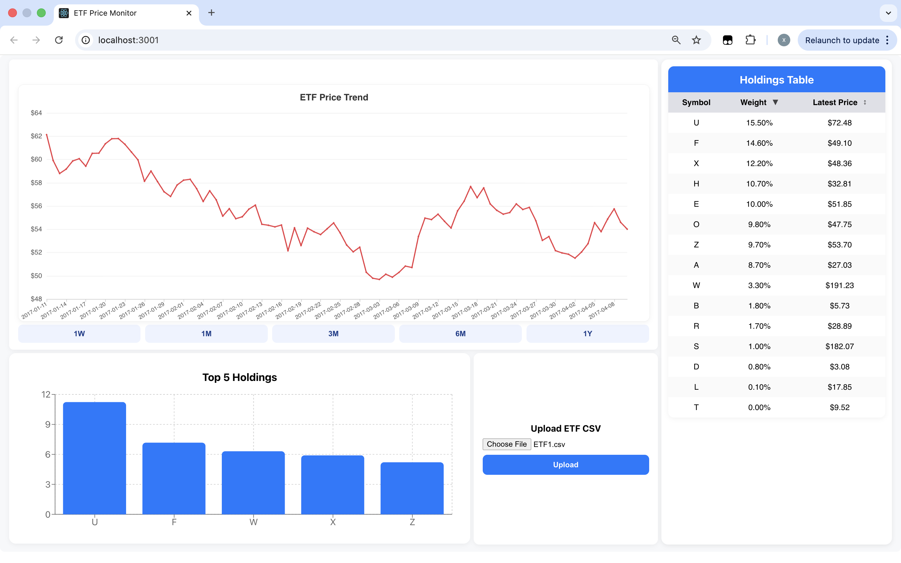
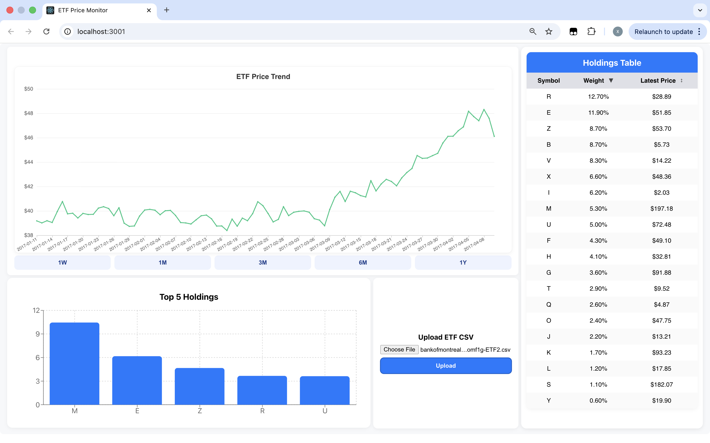

# ETF_Price_Monitor
A full-stack application for uploading, analyzing, and visualizing ETF (Exchange-Traded Fund) data.  
Frontend built with **React + ECharts + axios**, and backend powered by **python + FastAPI + Pandas**.

---

## features
 ### Frontend (React)
- Upload local ETF CSV files.  
- Interactive line chart for ETF price trends can scroll to zoom and drag to move.  
- Time-range filter buttons: **1W / 1M / 3M / 6M / 1Y**.  
- Bar chart for top 5 holdings.  
- Data table displaying detailed ETF holdings, and order by weight and latest Price.  
- Responsive dashboard using **CSS Grid + Flexbox**.  
- Automatic color for price trend (green ↑ / red ↓).  



### Backend (FastAPI)
- `POST /upload`: Parse uploaded ETF CSV files.  
- `GET /chart`: Return ETF price data for a given date range.  
- Efficient computation and data aggregation with **Pandas**.  

---

## How to start
 ### Run Frontend
```bash
cd ../etf_frontend
npm install
npm start
```
 ### Run Backend
```bash
cd ../etf_backend
pip install -r requirements.txt
uvicorn app.main:app --reload
```
- to run the backend tests
```bash
pytest -v
```
---
## API Design
 ### POST /upload
- upload an ETF CSV file and initialize a new analysis session.
```bash
POST /upload?days=90&session_id=optional
Content-Type: multipart/form-data
```
- days: The number of days to fetch for plotting the ETF price line. Defaults to 90. Used to perform lazy calculation in the backend.
- session_id: An existing session ID. If provided, the backend will reuse the cached session and skip recalculating the merged data frame based on the ETF file and the prices file.
- file:the ETF CSV file to upload.
- **successful Response:**
```json
{
  "session_id": "abc123",
  "chart": {
    "date": ["2024-01-01", "2024-01-02", "..."],
    "etf_price": [100.2, 101.8, 102.9]
  },
  "table": [
    {"symbol": "AAPL", "weight": 0.12, "holding_value": 5231.8},
    {"symbol": "MSFT", "weight": 0.10, "holding_value": 4872.3}
  ],
  "stats": {
    "total_value": 24920.4,
    "daily_change": 1.26
  }
}
```

 ### GET /chart
- Retrieve chart data for a session whthin a given date range
```bash
GET /chart?session_id=abc123&start=2024-01-01&end=2024-04-01
```
- session_id: (required) Identifies which ETF session to retrieve. Allows the backend to load the corresponding merged table from memory instead of recomputing it.
- start: (optional) The start date (inclusive).
- end: (optional) The end date (inclusive).
- **successful Response:**
```json
{
  "date": ["2024-01-01", "2024-03-01"],
  "etf_price": [100.2, 105.4, 108.9]
}
```
 ### Session Management
- The /upload endpoint initializes or updates a session, performing backend computation of ETF prices and weights.
- The /chart endpoint retrieves the computed price series for visualization without reprocessing the original CSV.

---
## Assumptions
- The system supports a single-user session stored in memory using etf_session_store.
- Each uploaded ETF CSV file must contain both “name” and “weight” columns.If either column is missing, the backend will raise an error, and the frontend will display an alert to notify the user.
- All price data comes from a local prices.csv loaded by PriceStore.
- PriceStore auto-refreshes itself periodically to keep all prices up to date.
- /upload merges ETF and price data once and caches the result for reuse.
- /chart retrieves data from the cached session without recomputation.
- No authentication or database persistence is implemented.
- The frontend (React) communicates with the backend (FastAPI) via CORS requests.
- Backend runs at 127.0.0.1:8000, frontend at localhost:3000.
- Error handling returns simple JSON with "detail" messages.


